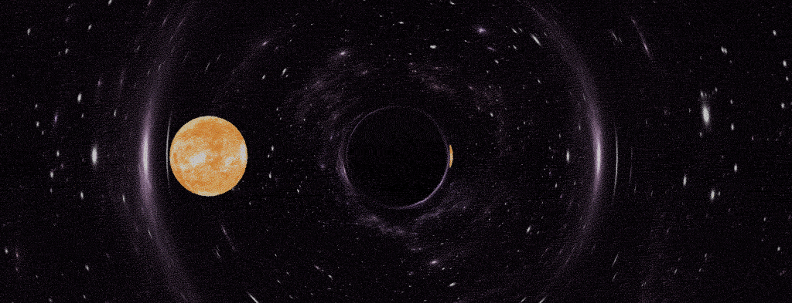

<h1 align="center">Curvedpy </h1>
<p align="center">
Author: <a href="https://www.linkedin.com/in/bldevries/" target="_blank">BL de Vries</a>. PhD and Scientific visualisation advisor at <a href="https://www.surf.nl" target="_blank">SURF</a>.
</p>
<div align="center">

</div>
<div align="center">
<sub><sup>A star-like object (textured mesh in Blender) in orbit around a Schwarzschild black hole</sup></sub>
</div>

## Introduction
This python package is written to accompany the <a href="https://github.com/bldevries/blackhole_geodesic_calculator" target="_blank">relativistic render engine</a> I developed for Blender. But this package can be used for other projects just as well. It aims to calculate geodesics (trajectories) of massive particles and photons in curved space-time (different metrics). As of now (4 Dec 2024) the Schwarzschild metric (a spherically symmetric blackhole) is implemented. The Kerr blackhole (a rotating blackhole) will follow soon and is in developement. In the following sections I will explain how to install and use this package as well as some background information on how it works.

<div align="center">

</div>
<div align="center">
<sub><sup>A Schwarzschild black hole moving sideways, warping a skydome image of stars as it goes</sup></sub>
</div>


## Linked repositories:
- Geodesic approximations: https://github.com/bldevries/curvedApproxPy

## Using curvedpy
If you find curvedpy usefull and use it in your projects, please give me credit by mentioning this repo!

## Installation
Just install from pip from this in your preferred environment:

<i>pip install curvedpy</i>

The dependencies are few, most notably it uses <a href="https://www.sympy.org/en/index.html" target="_blank">sympy</a>.

## Tutorials
For the basics on how to use the package, see this [notebook](https://github.com/bldevries/curvedpy/blob/main/tutorials/Tutorial_1_calc_geodesic.ipynb)

## How it works - physics & math!
This section is for those interested in the physics and maths. I will loosely explain how the path travelled by bodies in four-dimensional space-times is calculated given a metric. I will leave out most of the math and proper definitions. It needs to be readable by people that have studied some calculus and mechanics. If you have studied some General Relativity and/or differential geometry, please keep the goal of the oversimplifications I make in mind. :) 

### Trajectories in space-time: the geodesic equation
So, let’s start with Newtons second law. In flat space the motion of bodies (in the classical limit) is described by the second law of Newton:

$$
\frac{d^2 x}{dt^2} = F/m
$$

Where F is the net force acting on the body, m is the body's mass and x is the location of the body. If no force is acting on the body this reduces to:

$$
\frac{d^2 x}{dt^2} = 0
$$

Which states that the velocity of the body is constant and $x(t)$ is a linear function of time. Or in other words, the body follows a straight line.

In General Relativity a similar equation as the second law of Newton exists and is called the geodesic equation:

$$
\frac{d^2 x^{\alpha}}{d\tau^2} + \Gamma^{\alpha}_{\mu \nu} \frac{d x^{\nu}}{d\tau} \frac{d x^{\mu}}{d\tau} = 0
$$

This equation describes the motion of a body in four-dimensional space (thus including time). At first sight this equation does not look similar to Newtons second law but let’s have a look. As with Newtons equation the $x$ describes the location of the body. Here $x^{\alpha}$ is the location of the body in four dimensional space. $x^{0}$ is the time coordinate and $x^{1}$, $x^{2}$ and $x^{3}$ are the spatial coordinates. You see that $\alpha$ (just as $\mu$ and $\nu$) is an index of the four-vector $x^{\alpha}$

Now $\frac{d^2 x^{\alpha}}{d\tau^2}$ is the second derivative of the four-location $x$ to the parameter $\tau$. Here $\tau$ serves the function that time does in Newtons equation. The solution of the geodesic equation is thus $x(\tau)$, which describes a path in four-space. If the second term:

$$\Gamma^{\alpha}_{\mu \nu} \frac{d x^{\nu}}{d\tau} \frac{d x^{\mu}}{d\tau}$$

would not exist, the geodesic equation would reduce to Newtons equation (with F=0) and taking $\tau = x^{0} = t$. 

The term with $\Gamma$ adds the effect of curved space to the geodesic equation and with that the geodesic equation becomes an equation that describes straight lines in curved space.

(Note to self: Add more information on different and equivalent definitions of a straight line?)

The $\Gamma$ encodes all information of the curvature of space and these numbers are called Christoffel Symbols or Connection Symbols. They are calculated and defined as:

$$\Gamma^{\sigma}\_{\mu \nu} = \frac{1}{2} g^{\sigma \rho} (\partial\_{\mu} g_{\nu \rho} + \partial\_{\nu} g\_{\rho \mu} - \partial\_{\rho} g\_{\mu \nu})$$

Where $g_{\mu \nu}$ is the space-time metric. In short it encodes the length of between two points in space-time and is a part of the inner product between vectors.

Even though you have used the metric of flat Euclidean space many times, you might not have realized. This is because the metric in Euclidian space is:

$$
G_{\text{flat}} = 
\begin{bmatrix}
1 & 0 & 0\\
0 & 1 & 0\\
0 & 0 & 1\\
\end{bmatrix}
$$

Here I have written the metric in Matrix notation. (For the connoisseur, the metric is a rank-2 tensor $g_{\sigma \rho}$). And the metric is part of the length of a vector through the inner product. The the length of a vector $\vec{V}$ is:

$$
\vec{V}\cdot\vec{V} = \vec{V}^{T} G_{\text{flat}} \vec{V} = \vec{V}^{T} \vec{V} = v_1^2 + v_2^2 + v_3^3
$$

Here we use standard matrix multiplication, $\vec{V}^{T}$ is the transpose of $\vec{V}$ making it a row vector and the components of $\vec{V}$ are $(v_1, v_2, v_3)$. And you see it all kind of ends with Pythagoras theorem, and you see why you might never have heard of the metric. 

A nice example of a more complicated metric in a familiar setting is that of the surface of a sphere. If you are interested in what this metric looks like and how you can use it, see my blog [Calculating lengths in curved spaces using SymPy’s symbolic mathematics, Python and Matplotlib](https://medium.com/@bldevries/calculating-lengths-in-curved-spaces-using-sympys-symbolic-mathematics-python-and-matplotlib-7c18da99fd7b).

### A blackhole metric

One of the metrics implemented in curvedpy is the Schwarzschild metric that describes space-time around a spherically symmetric blackhole. In Spherical coordinates this looks like:

$$
g_{\sigma \rho} = 
\begin{bmatrix}
-(1-\frac{r_s}{r}) & 0 & 0 & 0\\
0 & \left(1-\frac{r_s}{r}\right)^{-1} & 0 & 0\\
0 & 0 & r^2 & 0\\
0 & 0 & 0 & r^2 \sin^2(\theta)
\end{bmatrix}
$$

The package curvedpy uses the Schwarzschild metric in cartesian or spherical coordinates. 

### Numerically solving the geodesic equation
For the code I have implemented I have used techniques from several peer-reviewed papers and books, among which:
* <a href="https://arxiv.org/abs/1801.10452" target="_blank">Bronzwaer et al 2018: https://arxiv.org/abs/1801.10452 </a>
* <a href="https://arxiv.org/abs/2303.15522" target="_blank">Davelaar et al 2023: https://arxiv.org/abs/2303.15522 </a>
* <a href="https://arxiv.org/abs/2302.02733" target="_blank">Moscibrodzka et al 2023: https://arxiv.org/abs/2302.02733 </a>
* A first course in general relativity. Bernard Schutz
* Spacetime and geometry. Carroll

Let me briefly explain how I solve the geodesic equation. The geodesic equation is a not quite linear second order differential equation, so we need to use some numerical techniques to tackle it. The scipy packages has some nice integrators which we can use through the function ```solve_ivp```. For a simple example of how you can use this function check out my blog [Simply solving differential equations using Python, scipy and solve_ivp](https://medium.com/@bldevries/simply-solving-differential-equations-using-python-scipy-and-solve-ivp-f6185da2572d). 

For ```solve_ivp``` to work we need to split the geodesic equation in first order equations by introducing the "velocity" $k^{\mu}$:

$$
\frac{d k^{\alpha}}{d \lambda} = 
\text{ } -\Gamma^{\alpha}_{\nu \mu} \text{ }
k^{\mu} \text{ } 
k^{\nu}
$$

$$
\frac{d x^{\beta}}{d\lambda} = k^{\beta}
$$

Now we can integrate these equations (these are 8 equations since the indices can take on 4 values) if we have an initial condition for the location $x$ and the "velocity" $k$. Or in other words, we need to have a beginning location and direction of movement. 

To learn more about the metric, you can start with this [jupyter notebook](tutorials/The_math_and_physics_behind_curvedpy.ipynb). To learn more about how to solve geodesics in curved spacetime, see this [tutorial](https://github.com/bldevries/curvedpy/blob/main/tutorials/Tutorial_1_calc_geodesic.ipynb)


